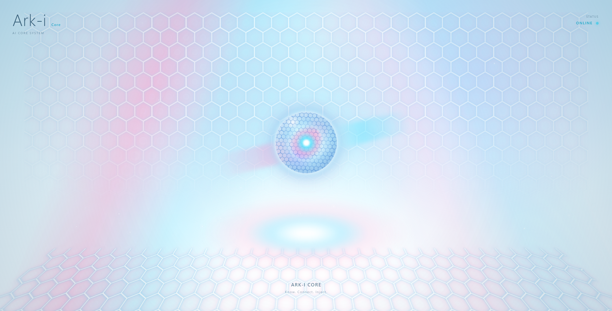
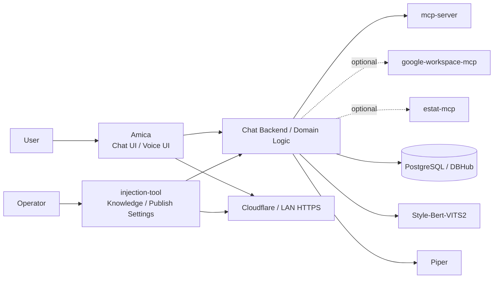
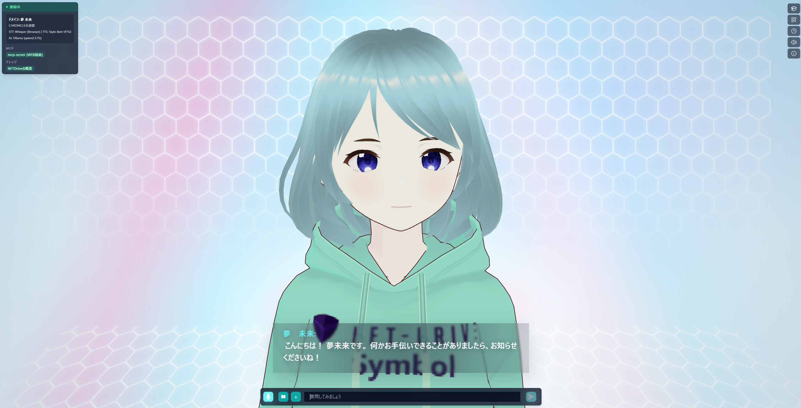
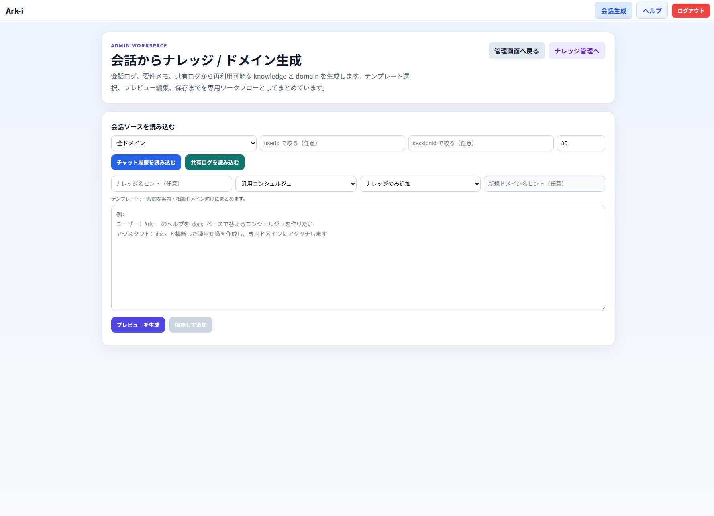

# ark-injection-ai-system

<p align="center">
	<a href="https://nftdrive.net/"></a>
	
	
	
</p>

<p align="center">
	Ark-i / Amica / injection-tool / MCP servers / TTS services を束ねて動かす、<br>
	ドメイン注入型 AI システムの統合実行環境。
</p>

<p align="center">
	
</p>

English summary:

ark-injection-ai-system is a Docker Compose-based orchestration layer for Ark-i, Amica, injection-tool, MCP servers, TTS services, and supporting infrastructure. It is built for domain-injected AI deployments that combine chat UI, knowledge injection, external tools, voice synthesis, and controlled public exposure in one operational stack.

運営会社: [NFTDrive](https://nftdrive.net/)

## Why This Repo

- ドメインごとに知識、UI、音声、外部連携を切り替えられる
- 会話 UI と管理 UI を分離し、運用しやすい構成で扱える
- Google Workspace、e-Stat、DBHub などを MCP 経由で統合できる
- Piper / Style-Bert-VITS2 などの音声合成を同じ Compose で束ねられる
- ローカル検証、PoC、本番公開まで同じ構成思想で持っていける
- ドメイン毎に会話のフルログDBを設定できる
- アバターは2D画像や軽量なHTML+CSS、VRMなど利用可能
- Webカメラを使った視線起動ができる


## System Snapshot




## Screenshots

| Amica UI | Domain / Knowledge Admin |
| --- | --- |
|  |  |

スクリーンショット差し替えルールと追加候補は [docs/images/readme/README.md](docs/images/readme/README.md) にまとめています。

## Demo Video

[](https://www.youtube.com/watch?v=KkAgpVP2Bv8)


## Core Services

基本スタックは Amica / injection-tool / mcp-server / SBV2(or Piper) / PostgreSQL / DBHub です。  
`google-workspace-mcp` と `estat-mcp` は必要なときだけ追加起動する optional サービスです。

| サービス | 役割 | 既定ポート |
| --- | --- | ---: |
| Amica | ユーザー向け会話 UI | 3000 |
| injection-tool | 知識注入、管理画面、公開設定 API | 4001 |
| mcp-server | 汎用 MCP ルーター / 検証用サーバー | 8000 |
| google-workspace-mcp | Google Workspace 連携 / optional | 8001 |
| estat-mcp | e-Stat 連携 / optional | 8002 |
| SBV2 / Piper | 音声合成 | 5000 / 5001 |
| PostgreSQL | 永続データ保存 | 5432 |
| DBHub | DB ゲートウェイ | 8080 |

## Quick Start

### 0. Bootstrap Workspace

このリポジトリ自体を先に clone したあと、関連リポジトリの clone、`.env` の初期生成、VS Code workspace ファイル作成をまとめて行うには、次のスクリプトを使えます。

```powershell
git clone https://github.com/nftdrive01-maker/ark-injection-ai-system.git
cd ark-injection-ai-system
.\scripts\setup-workspace.ps1 -ChatBackend chatgpt
```

WSL / Linux の bash から実行する場合は、PowerShell 記法の `./scripts/setup-workspace.ps1` や `.\scripts\setup-workspace.ps1` ではなくシェルラッパーを使ってください。

```bash
git clone https://github.com/nftdrive01-maker/ark-injection-ai-system.git
cd ark-injection-ai-system
bash ./scripts/setup-workspace.sh -ChatBackend chatgpt
```

Google Workspace MCP や e-Stat MCP をまだ使わない場合は、clone 対象と workspace 登録から外せます。

```powershell
.\scripts\setup-workspace.ps1 -ChatBackend chatgpt -SkipGoogleWorkspaceMcp -SkipEstatMcp
```

```bash
bash ./scripts/setup-workspace.sh -ChatBackend chatgpt -SkipGoogleWorkspaceMcp -SkipEstatMcp
```

補足:

- 既定では、現在の `ark-injection-ai-system` ディレクトリの親フォルダを workspace ルートとして扱います
- `-ChatBackend chatgpt` を指定すると OpenAI 系、`-ChatBackend ollama` を指定すると Ollama 系の初期値で `.env` を準備します
- `-SkipGoogleWorkspaceMcp` と `-SkipEstatMcp` は clone 対象と生成する `.code-workspace` から該当リポジトリを外します
- WSL / Linux でこの bootstrap を使う場合は `pwsh` が必要です
- 音声モデル、アバター素材、キャラクターモデル、秘密情報はこのスクリプトでは取得しません
- `-StartStack` は Amica / injection-tool / mcp-server / SBV2 の基本スタックを起動します。`google-workspace-mcp` と `estat-mcp` は optional profile なので、この起動には含まれません

初回起動の見え方について:

- Ark-i Core の CSS ベース既定表示はこの構成に含まれるため、最低限の画面確認はそのまま行えます
- ただし音声を出すには、Piper または Style-Bert-VITS2 の音声モデルを別途用意する必要があります
- 公開テンプレートの `.env.example` では `PIPER_MODEL_URL` と `PIPER_CONFIG_URL` は空です。Piper を使う場合は利用する音声モデルに合わせて設定してください
- 音声モデルの設定例と切り替え手順は [14_PIPER_TTS_SETUP_AND_SWITCH_JA.md](./docs/14_PIPER_TTS_SETUP_AND_SWITCH_JA.md) と [16_MODEL_SWITCH_MANUAL_JA.md](./docs/16_MODEL_SWITCH_MANUAL_JA.md) を参照してください
- SBV2 自体の初回準備、CPU/CUDA 切替、起動確認、トラブル切り分けは [SBV2_CPU_CUDA_SWITCH_MANUAL_JA.md](./SBV2_CPU_CUDA_SWITCH_MANUAL_JA.md) を参照してください

optional MCP も起動したい場合:

```powershell
.\scripts\dev-up-container-sbv2.ps1 -Build -IncludeGoogleWorkspaceMcp -IncludeEstatMcp
```

WSL2 ベースで導入したい場合:

- Windows 版 Ollama を残して他を WSL2 で動かす手順は [17_WSL2_WINDOWS_OLLAMA_MANUAL_JA.md](./docs/17_WSL2_WINDOWS_OLLAMA_MANUAL_JA.md)
- Ollama も含めて WSL2 側へ寄せる手順は [18_FULL_WSL2_INSTALLATION_MANUAL_JA.md](./docs/18_FULL_WSL2_INSTALLATION_MANUAL_JA.md)

## Recommended Environment

利用する推論方式によって、必要なローカルスペックが変わります。

### OpenAI API を主に使う場合

会話や画像認識を OpenAI 側に寄せて、ローカルでは Docker 上のアプリ群と TTS を動かす前提です。

| 項目 | 最低目安 | 推奨 |
| --- | --- | --- |
| OS | Windows 10 / 11 | Windows 11 |
| CPU | 4 コア以上 | 6 から 8 コア以上 |
| メモリ | 16GB | 32GB |
| ストレージ空き容量 | 30GB 以上 SSD | 50GB 以上 SSD |
| Docker Desktop 割当 | 8GB 以上 | 12 から 16GB |
| GPU | 不要 | 不要 |
| ネットワーク | 常時インターネット接続 | 安定した常時接続 |

### Ollama をローカルで使う場合

会話モデルや画像認識モデルをローカルの Ollama で持つ場合は、OpenAI 前提より一段重く見てください。

| 項目 | 最低目安 | 推奨 |
| --- | --- | --- |
| OS | Windows 11 | Windows 11 |
| CPU | 6 コア以上 | 8 コア以上 |
| メモリ | 32GB | 64GB 以上 |
| ストレージ空き容量 | 80GB 以上 SSD | 150GB 以上 SSD |
| Docker Desktop 割当 | 12GB 以上 | 16GB 以上 |
| GPU | なくても可だが低速 | NVIDIA GPU 推奨 |
| GPU VRAM | なしでも可 | 12GB 以上 |
| ネットワーク | 初回取得時に必要 | 初回取得時と更新時に必要 |

補足:

- OpenAI 前提であれば、会話モデルや画像認識モデルのためのローカル GPU は必須ではありません
- ただし Docker 上で Amica、injection-tool、PostgreSQL、Piper、MCP 群を同時に動かすため、8GB RAM の PC だと厳しめです
- Ollama でローカル LLM を使う場合、モデルサイズに応じてメモリとディスク使用量が大きく増えます
- 7B から 8B 級モデルを CPU 中心で動かすだけでも 32GB 前後あるほうが安全で、より大きいモデルや vision 系モデルでは GPU が現実的です
- SBV2 をローカルで本格運用する場合は、Ollama とは別に GPU 利用可否も確認してください
- 初回セットアップ時はコンテナ build、依存取得、音声モデル配置のためにディスクとネットワークに余裕があるほうが安全です

### 1. Prerequisites

- Docker Desktop
- Docker Compose
- 必要に応じて Ollama または OpenAI 互換 API

### 2. Prepare `.env`

`.env.example` を `.env` にコピーして必要な値を設定します。

```powershell
Copy-Item .env.example .env
```

最低限の見直し対象:

- `AMICA_CHATBOT_BACKEND`: 会話に使う接続先を選びます。`ollama` か `chatgpt` などをここで決めます
- `AMICA_OLLAMA_URL`: Ollama を使う場合の接続先 URL です
- `AMICA_OLLAMA_MODEL`: Ollama を使う場合のモデル名です
- `INJECTION_ADMIN_USERNAME`: injection-tool 管理画面にログインするユーザー名です
- `INJECTION_ADMIN_PASSWORD`: injection-tool 管理画面にログインするパスワードです
- `INJECTION_SESSION_SECRET`: 管理画面のセッションを保護する秘密値です

Google Workspace MCP を使う場合に追加で必要な項目:

- `GOOGLE_OAUTH_CLIENT_ID`: Google Workspace MCP 用の OAuth クライアント ID です
- `GOOGLE_OAUTH_CLIENT_SECRET`: Google Workspace MCP 用の OAuth クライアントシークレットです

使い分けの目安:

- OpenAI を使う場合は `AMICA_CHATBOT_BACKEND=chatgpt` と API キー系を設定します
- Ollama を使う場合は `AMICA_CHATBOT_BACKEND=ollama` と `AMICA_OLLAMA_URL` / `AMICA_OLLAMA_MODEL` を設定します
- Google Workspace MCP を使わない場合は OAuth 項目は後回しでも構いません

### 3. Start Development Stack

```powershell
docker compose -f docker-compose.yml -f docker-compose.dev.yml up -d
```

起動後の既定 URL:

- Amica: http://localhost:3000
- injection-tool: http://localhost:4001

### 4. Production-Like Layout

`docker-compose.prod.yml` は公開イメージ参照ではなく、相対パスの build context / volume を使います。  
そのため、本番相当の別環境で起動する場合も、少なくとも以下のリポジトリやローカル配置が必要です。

- `../amica` : https://github.com/nftdrive01-maker/amica-nftdrive
- `../injection-tool` : https://github.com/nftdrive01-maker/ark-injection-tool
- `../mcp-server` : https://github.com/nftdrive01-maker/ark-mcp-server
- `../sbv2/Style-Bert-VITS2` : https://github.com/nftdrive01-maker/Style-Bert-VITS2-nftdrive
- `../google-workspace-mcp` : https://github.com/nftdrive01-maker/google_workspace_mcp-nftdrive
- `../estat-mcp` : https://github.com/nftdrive01-maker/estat-mcp-nftdrive
- `../piper` : https://github.com/nftdrive01-maker/piper-nftdrive

推奨配置例:

```text
workspace/
	ark-injection-ai-system/
	amica/
	injection-tool/
	mcp-server/
	sbv2/Style-Bert-VITS2/
	google-workspace-mcp/
	estat-mcp/
	piper/
```

この並びを手作業で作る代わりに、`ark-injection-ai-system` を clone したあとで `scripts/setup-workspace.ps1` を使う方法もあります。

### 5. Start Production Stack

```powershell
docker compose -f docker-compose.yml -f docker-compose.prod.yml up -d --build
```

`google-workspace-mcp` を使う場合は、`ark-injection-ai-system/google-workspace-mcp-credentials` に OAuth credential を配置してください。

## GitHub 管理外で別途必要なもの

リポジトリ一式は GitHub から取得できますが、以下は公開リポジトリに含めず別管理してください。

- `.env` に入れる秘密情報
	- `GOOGLE_OAUTH_CLIENT_ID`
	- `GOOGLE_OAUTH_CLIENT_SECRET`
	- `INJECTION_ADMIN_USERNAME`
	- `INJECTION_ADMIN_PASSWORD`
	- `INJECTION_SESSION_SECRET`
	- `AMICA_OPENAI_APIKEY` や `ESTAT_APP_ID` などの外部 API キー
- `ark-injection-ai-system/google-workspace-mcp-credentials/` に配置する OAuth credential / token 類
- `../sbv2/Style-Bert-VITS2/model_assets` と `../sbv2/Style-Bert-VITS2/bert` に配置される SBV2 推論用モデル資産
- `../piper/data` に初回起動時ダウンロードまたは事前配置される Piper モデル実体
- アバター画像、Live2D などのキャラクター素材やキャラクターモデル

GitHub から取得できるのはコードと Compose 構成です。認証情報、永続 credential、音声モデル資産、アバター素材、キャラクターモデルは別途用意が必要です。

このリポジトリでは音声モデル実体やキャラクター素材を配布しません。Piper / Style-Bert-VITS2 の各モデル、アバター素材、キャラクターモデルは、利用者が権利関係を確認のうえ別途取得・配置してください。

## External Publishing

フロントアプリの一時公開には Cloudflare Quick Tunnel を使えます。

```powershell
cloudflared tunnel --url http://localhost:3000
```

公開 URL を固定したい場合や、管理画面を安全に外部公開したい場合は Cloudflare Named Tunnel + Cloudflare Access を推奨します。

詳細:

- [EXTERNAL_PUBLISH_MANUAL_JA.md](EXTERNAL_PUBLISH_MANUAL_JA.md)
- [docs/13_CLOUDFLARE_ACCESS_SETUP_JA.md](docs/13_CLOUDFLARE_ACCESS_SETUP_JA.md)

## Documentation

- [docs/01_SYSTEM_OVERVIEW_JA.md](docs/01_SYSTEM_OVERVIEW_JA.md)
- [docs/05_SETUP_AND_DEPLOYMENT_JA.md](docs/05_SETUP_AND_DEPLOYMENT_JA.md)
- [docs/06_SECURITY_AND_PUBLIC_EXPOSURE_JA.md](docs/06_SECURITY_AND_PUBLIC_EXPOSURE_JA.md)
- [docs/16_MODEL_SWITCH_MANUAL_JA.md](docs/16_MODEL_SWITCH_MANUAL_JA.md)
- [docs/README_JA.md](docs/README_JA.md)

## Related Repositories

- Amica fork: https://github.com/nftdrive01-maker/amica-nftdrive
- Amica fork の既定運用ブランチ: feat-add-injection
- injection-tool fork: https://github.com/nftdrive01-maker/ark-injection-tool
- mcp-server fork: https://github.com/nftdrive01-maker/ark-mcp-server
- google-workspace-mcp fork: https://github.com/nftdrive01-maker/google_workspace_mcp-nftdrive
- estat-mcp fork: https://github.com/nftdrive01-maker/estat-mcp-nftdrive
- piper fork: https://github.com/nftdrive01-maker/piper-nftdrive
- Style-Bert-VITS2 fork: https://github.com/nftdrive01-maker/Style-Bert-VITS2-nftdrive

このリポジトリの Compose は `../amica` のローカル checkout を bind mount するため、実際に参照される内容は GitHub の `master` ではなくローカルで checkout しているブランチです。NFTDrive 運用では `feat-add-injection` を前提にしています。

## License and Usage

- 個人利用は無料
- コード改変は可能
- 法人、団体、行政、商用利用は有償ライセンス対象
- アバター音声、音声モデル、キャラクターモデル、各種素材は基本的に利用者が別途用意してください
- 各素材やモデルの利用条件、クレジット表記、商用利用可否は採用元の規約に従ってください
- 詳細は [LICENSE.md](LICENSE.md)
- OSS ライセンス案内は [OPEN_SOURCE_NOTICES.md](OPEN_SOURCE_NOTICES.md)

商用利用や導入相談は NFTDrive までお問い合わせください。

## Runtime Model Configuration

このリポジトリは会話モデル、画像認識モデル、音声モデルの実体に加えて、アバター素材やキャラクターモデルも配布しません。

Ark-i / Amica / Piper / Style-Bert-VITS2 の各ランタイムは Docker Compose で接続できるようにしていますが、実際に利用するモデルや素材は運用者が別途選定し、ライセンス確認のうえ設定してください。

| 用途 | 主な設定項目 | 備考 |
| --- | --- | --- |
| 会話 | `AMICA_CHATBOT_BACKEND`, `AMICA_OLLAMA_MODEL`, `AMICA_OPENAI_MODEL` | 利用モデルのライセンスは各配布元に従います |
| 画像認識 | `AMICA_VISION_BACKEND`, `AMICA_VISION_OLLAMA_MODEL` | 利用モデルのライセンスは各配布元に従います |
| 音声合成 | `AMICA_TTS_BACKEND`, `PIPER_MODEL_URL`, `PIPER_CONFIG_URL` | 音声モデルのライセンスはランタイム本体と別です |

公開リポジトリの既定値では、特定の音声モデル実体、学習済みモデル、アバター素材、キャラクターモデルを配布しません。Piper / Style-Bert-VITS2 の音声モデルや表示用素材は、利用者が別途取得・配置してください。

## Voice Model License Notes

音声モデルのクレジット表記や利用条件は、採用するモデルごとに異なります。このリポジトリは特定の音声モデル実体を配布しません。

公開 README としての基本方針は、音声モデルやキャラクター素材を同梱せず、利用者が自分の利用条件に合うものを別途用意することです。

補足:

- 有料提供時や公開配布時の条件は、採用する音声モデルの配布元規約を確認してください。
- キャラクター音声やコーパス由来モデルでは、クレジット表示や公開形態に関する条件が個別に設定されている場合があります。
- Style-Bert-VITS2 のコードライセンスと、`model_assets` 配下の学習済み音声モデルの条件は別です。

## Notes

- `.env`、OAuth credential、ローカル証明書、各種ログは公開リポジトリに含めないでください
- Quick Tunnel は URL が毎回変わるため、本番運用には向きません
- Google Workspace 連携を使う場合は OAuth コールバック URL の更新が必要です
