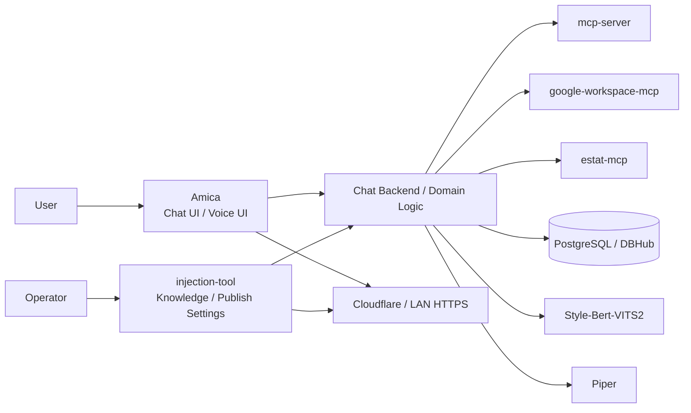

# ark-injection-ai-system

<p align="center">
	<a href="https://nftdrive.net/"></a>
	
	
	
</p>

<p align="center">
	Ark-i / Amica / injection-tool / MCP servers / TTS services を束ねて動かす、<br>
	ドメイン注入型 AI システムの統合実行環境。
</p>

<p align="center">
	
</p>

English summary:

ark-injection-ai-system is a Docker Compose-based orchestration layer for Ark-i, Amica, injection-tool, MCP servers, TTS services, and supporting infrastructure. It is built for domain-injected AI deployments that combine chat UI, knowledge injection, external tools, voice synthesis, and controlled public exposure in one operational stack.

運営会社: [NFTDrive](https://nftdrive.net/)

## Why This Repo

- ドメインごとに知識、UI、音声、外部連携を切り替えられる
- 会話 UI と管理 UI を分離し、運用しやすい構成で扱える
- Google Workspace、e-Stat、DBHub などを MCP 経由で統合できる
- Piper / Style-Bert-VITS2 などの音声合成を同じ Compose で束ねられる
- ローカル検証、PoC、本番公開まで同じ構成思想で持っていける

## System Snapshot




## Screenshots

| Amica UI | Domain / Knowledge Admin |
| --- | --- |
|  |  |

スクリーンショット差し替えルールと追加候補は [docs/images/readme/README.md](docs/images/readme/README.md) にまとめています。

## Core Services

| サービス | 役割 | 既定ポート |
| --- | --- | ---: |
| Amica | ユーザー向け会話 UI | 3000 |
| injection-tool | 知識注入、管理画面、公開設定 API | 4001 |
| mcp-server | 汎用 MCP ルーター / 検証用サーバー | 8000 |
| google-workspace-mcp | Google Workspace 連携 | 8001 |
| estat-mcp | e-Stat 連携 | 8002 |
| SBV2 / Piper | 音声合成 | 5000 / 5001 |
| PostgreSQL | 永続データ保存 | 5432 |
| DBHub | DB ゲートウェイ | 8080 |

## Quick Start

### 1. Prerequisites

- Docker Desktop
- Docker Compose
- 必要に応じて Ollama または OpenAI 互換 API

### 2. Prepare `.env`

`.env.example` を `.env` にコピーして必要な値を設定します。

```powershell
Copy-Item .env.example .env
```

最低限の見直し対象:

- `AMICA_CHATBOT_BACKEND`
- `AMICA_OLLAMA_URL`
- `AMICA_OLLAMA_MODEL`
- `INJECTION_ADMIN_USERNAME`
- `INJECTION_ADMIN_PASSWORD`
- `INJECTION_SESSION_SECRET`
- `GOOGLE_OAUTH_CLIENT_ID`
- `GOOGLE_OAUTH_CLIENT_SECRET`

### 3. Start Development Stack

```powershell
docker compose -f docker-compose.yml -f docker-compose.dev.yml up -d
```

起動後の既定 URL:

- Amica: http://localhost:3000
- injection-tool: http://localhost:4001

### 4. Production-Like Layout

`docker-compose.prod.yml` は公開イメージ参照ではなく、相対パスの build context / volume を使います。  
そのため、本番相当の別環境で起動する場合も、少なくとも以下のリポジトリやローカル配置が必要です。

- `../amica` : https://github.com/nftdrive01-maker/amica-nftdrive
- `../injection-tool` : https://github.com/nftdrive01-maker/ark-injection-tool
- `../mcp-server` : https://github.com/nftdrive01-maker/ark-mcp-server
- `../sbv2/Style-Bert-VITS2` : https://github.com/nftdrive01-maker/Style-Bert-VITS2-nftdrive
- `../google-workspace-mcp` : https://github.com/nftdrive01-maker/google_workspace_mcp-nftdrive
- `../estat-mcp` : https://github.com/nftdrive01-maker/estat-mcp-nftdrive
- `../piper` : https://github.com/nftdrive01-maker/piper-nftdrive

推奨配置例:

```text
workspace/
	ark-injection-ai-system/
	amica/
	injection-tool/
	mcp-server/
	sbv2/Style-Bert-VITS2/
	google-workspace-mcp/
	estat-mcp/
	piper/
```

### 5. Start Production Stack

```powershell
docker compose -f docker-compose.yml -f docker-compose.prod.yml up -d --build
```

`google-workspace-mcp` を使う場合は、`ark-injection-ai-system/google-workspace-mcp-credentials` に OAuth credential を配置してください。

## GitHub 管理外で別途必要なもの

リポジトリ一式は GitHub から取得できますが、以下は公開リポジトリに含めず別管理してください。

- `.env` に入れる秘密情報
	- `GOOGLE_OAUTH_CLIENT_ID`
	- `GOOGLE_OAUTH_CLIENT_SECRET`
	- `INJECTION_ADMIN_USERNAME`
	- `INJECTION_ADMIN_PASSWORD`
	- `INJECTION_SESSION_SECRET`
	- `AMICA_OPENAI_APIKEY` や `ESTAT_APP_ID` などの外部 API キー
- `ark-injection-ai-system/google-workspace-mcp-credentials/` に配置する OAuth credential / token 類
- `../sbv2/Style-Bert-VITS2/model_assets` と `../sbv2/Style-Bert-VITS2/bert` に配置される SBV2 推論用モデル資産
- `../piper/data` に初回起動時ダウンロードまたは事前配置される Piper モデル実体

GitHub から取得できるのはコードと Compose 構成です。認証情報、永続 credential、音声モデル資産は別途用意が必要です。

このリポジトリでは音声モデル実体は配布しません。Piper / Style-Bert-VITS2 の各モデルは、利用者がライセンスを確認のうえ別途取得・配置してください。

## External Publishing

フロントアプリの一時公開には Cloudflare Quick Tunnel を使えます。

```powershell
cloudflared tunnel --url http://localhost:3000
```

公開 URL を固定したい場合や、管理画面を安全に外部公開したい場合は Cloudflare Named Tunnel + Cloudflare Access を推奨します。

詳細:

- [EXTERNAL_PUBLISH_MANUAL_JA.md](EXTERNAL_PUBLISH_MANUAL_JA.md)
- [docs/13_CLOUDFLARE_ACCESS_SETUP_JA.md](docs/13_CLOUDFLARE_ACCESS_SETUP_JA.md)

## Documentation

- [docs/01_SYSTEM_OVERVIEW_JA.md](docs/01_SYSTEM_OVERVIEW_JA.md)
- [docs/05_SETUP_AND_DEPLOYMENT_JA.md](docs/05_SETUP_AND_DEPLOYMENT_JA.md)
- [docs/06_SECURITY_AND_PUBLIC_EXPOSURE_JA.md](docs/06_SECURITY_AND_PUBLIC_EXPOSURE_JA.md)
- [docs/README_JA.md](docs/README_JA.md)

## Related Repositories

- Amica fork: https://github.com/nftdrive01-maker/amica-nftdrive
- Amica fork の既定運用ブランチ: feat-add-injection
- injection-tool fork: https://github.com/nftdrive01-maker/ark-injection-tool
- mcp-server fork: https://github.com/nftdrive01-maker/ark-mcp-server
- google-workspace-mcp fork: https://github.com/nftdrive01-maker/google_workspace_mcp-nftdrive
- estat-mcp fork: https://github.com/nftdrive01-maker/estat-mcp-nftdrive
- piper fork: https://github.com/nftdrive01-maker/piper-nftdrive
- Style-Bert-VITS2 fork: https://github.com/nftdrive01-maker/Style-Bert-VITS2-nftdrive

このリポジトリの Compose は `../amica` のローカル checkout を bind mount するため、実際に参照される内容は GitHub の `master` ではなくローカルで checkout しているブランチです。NFTDrive 運用では `feat-add-injection` を前提にしています。

## License and Usage

- 個人利用は無料
- コード改変は可能
- 法人、団体、行政、商用利用は有償ライセンス対象
- 詳細は [LICENSE.md](LICENSE.md)
- OSS ライセンス案内は [OPEN_SOURCE_NOTICES.md](OPEN_SOURCE_NOTICES.md)

商用利用や導入相談は NFTDrive までお問い合わせください。

## Runtime Model Configuration

このリポジトリは会話モデル、画像認識モデル、音声モデルの実体を配布しません。

Ark-i / Amica / Piper / Style-Bert-VITS2 の各ランタイムは Docker Compose で接続できるようにしていますが、実際に利用するモデルは運用者が別途選定し、ライセンス確認のうえ設定してください。

| 用途 | 主な設定項目 | 備考 |
| --- | --- | --- |
| 会話 | `AMICA_CHATBOT_BACKEND`, `AMICA_OLLAMA_MODEL`, `AMICA_OPENAI_MODEL` | 利用モデルのライセンスは各配布元に従います |
| 画像認識 | `AMICA_VISION_BACKEND`, `AMICA_VISION_OLLAMA_MODEL` | 利用モデルのライセンスは各配布元に従います |
| 音声合成 | `AMICA_TTS_BACKEND`, `PIPER_MODEL_URL`, `PIPER_CONFIG_URL` | 音声モデルのライセンスはランタイム本体と別です |

公開リポジトリの既定値では、特定の音声モデル実体や学習済みモデルを配布しません。Piper / Style-Bert-VITS2 の音声モデルは、利用者が別途取得・配置してください。

## Voice Model License Notes

音声モデルのクレジット表記や利用条件は、採用するモデルごとに異なります。このリポジトリは特定の音声モデル実体を配布しません。

以下は、つくよみちゃんコーパス由来モデルを採用する場合の参考クレジット例です。

> 本ソフトウェアの音声合成には、フリー素材キャラクター「つくよみちゃん」（© Rei Yumesaki）が無料公開している音声データを使用しています。
>
> ■つくよみちゃんコーパス（CV.夢前黎） https://tyc.rei-yumesaki.net/material/corpus/

補足:

- 有料提供時や公開配布時の条件は、採用する音声モデルの配布元規約を確認してください。
- つくよみちゃんコーパス由来モデルでは、クレジット表示や公開形態に関する条件があります。
- Style-Bert-VITS2 のコードライセンスと、`model_assets` 配下の学習済み音声モデルの条件は別です。

## Notes

- `.env`、OAuth credential、ローカル証明書、各種ログは公開リポジトリに含めないでください
- Quick Tunnel は URL が毎回変わるため、本番運用には向きません
- Google Workspace 連携を使う場合は OAuth コールバック URL の更新が必要です