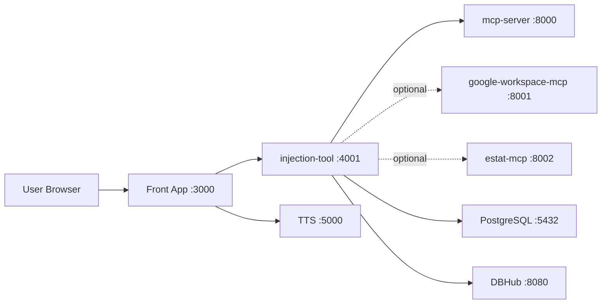

# アーキテクチャとデータフロー

## 全体像

ark-injection-ai-system は Docker Compose を中心に構成されるマルチサービス型システムです。ユーザーの入口は原則としてフロントアプリであり、内部では injection-tool、MCP サーバー群、TTS、DB に接続します。

基本スタックはフロントアプリ、injection-tool、mcp-server、TTS、DB、DBHub です。`google-workspace-mcp` と `estat-mcp` は必要なときだけ追加する optional MCP サービスです。

## 役割分担

### フロントアプリ
- ユーザー向け会話 UI
- 音声入力、音声出力、チャット表示
- ドメイン選択、会話履歴、接続状態表示
- injection-tool への BFF 経由アクセス

### injection-tool
- 会話直前の知識注入
- ドメイン管理
- MCP サーバー管理
- 公開設定、レート制限、Cloudflare Tunnel 制御
- セッション管理、共有ログ、チャット履歴 API

### MCP サーバー群
- mcp-server: テスト用または汎用 MCP 接続先
- google-workspace-mcp: Gmail、Drive、Calendar、Docs、Sheets などの optional 連携
- estat-mcp: 日本政府統計ポータル e-Stat の optional 連携
- DBHub: PostgreSQL を対象とした DB ゲートウェイ

### TTS
- 音声合成
- SBV2 と Piper を Docker Compose サービスとして運用

### PostgreSQL
- DBHub 経由のデータアクセス先
- 将来の永続データ保存先としても拡張可能

## Compose ベースの構成

既定の [docker-compose.yml](../docker-compose.yml) はサービスの論理接続と公開ポートを定義します。開発・本番・LAN HTTPS は差分 compose ファイルで上書きします。

| ファイル | 用途 |
|---|---|
| docker-compose.yml | 基本構成 |
| docker-compose.dev.yml | 開発用。Node.js 開発サーバー、bind mount、polling 有効 |
| docker-compose.prod.yml | 本番相当。フロントアプリと injection-tool を Dockerfile build で実行 |
| docker-compose.lan-https.yml | Caddy を追加し LAN HTTPS を提供 |

## 主要通信フロー

### 1. 通常チャット
1. ブラウザがフロントアプリに接続する
2. ユーザー入力をフロントアプリが受ける
3. フロントアプリが injection-tool に対して知識注入用リクエストを送る
4. injection-tool がドメイン設定や MCP 利用要否を判断する
5. 必要に応じて MCP サーバーや DBHub にアクセスする
6. injection-tool が注入結果を返す
7. フロントアプリが LLM へ最終メッセージを送る
8. 応答テキストを表示し、必要に応じて TTS へ音声合成リクエストを送る

### 2. Google Workspace 利用時
1. 管理者が google-workspace-mcp を構成する
2. OAuth 設定とリダイレクト URL を整備する
3. injection-tool が Google Workspace 用 MCP サーバーを呼び出す
4. 取得した結果を注入またはそのまま応答へ反映する

### 3. e-Stat 利用時
1. estat-mcp に ESTAT_APP_ID を設定する
2. injection-tool が `search_statistics` や `get_statistic_data` を利用する
3. 統計値、メタデータ、検索結果を応答に利用する

### 4. DB 利用時
1. PostgreSQL を database サービスで起動する
2. DBHub が `postgres://...@ark-database:5432/...` に接続する
3. injection-tool が DBHub または関連 MCP を通じて探索・検索を行う

## BFF を介する理由

このシステムでは、外部公開時に内部の MCP 群や DBHub を直接公開しないことが重要です。フロントアプリを入口にし、必要なサーバー側処理は injection-tool や BFF 経由で行うことで、以下の利点があります。

- ブラウザに内部 URL を直接露出しにくい
- 認証、レート制限、公開制御を一か所に寄せやすい
- fail-open やフォールバックを実装しやすい
- 外部公開時の攻撃面を減らしやすい

## 外部公開時の入口

推奨される公開入口はフロントアプリのみです。Cloudflare Tunnel または LAN HTTPS のいずれでも、原則としてブラウザはフロントアプリにだけ接続させます。

公開対象:
- フロントアプリ :3000 または HTTPS 化した入口

原則非公開:
- injection-tool :4001
- mcp-server :8000
- google-workspace-mcp :8001
- estat-mcp :8002
- TTS :5000
- DBHub :8080
- PostgreSQL :5432

## 関連資料

- 概要: [01_SYSTEM_OVERVIEW_JA.md](./01_SYSTEM_OVERVIEW_JA.md)
- 技術仕様: [03_TECHNICAL_SPEC_JA.md](./03_TECHNICAL_SPEC_JA.md)
- 構築手順: [05_SETUP_AND_DEPLOYMENT_JA.md](./05_SETUP_AND_DEPLOYMENT_JA.md)
- セキュリティ: [06_SECURITY_AND_PUBLIC_EXPOSURE_JA.md](./06_SECURITY_AND_PUBLIC_EXPOSURE_JA.md)
